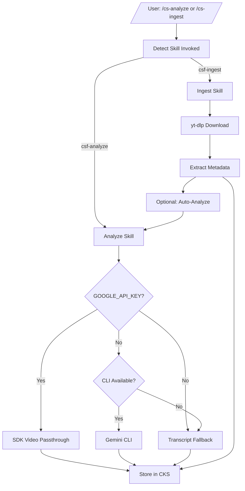

# intelligence-stream


YouTube playlist analysis pipeline — ingest videos and analyze content with Gemini, storing results in CKS (Constitutional Knowledge System).

## Quick Start

```powershell
# Ingest a playlist
/cs-ingest https://www.youtube.com/playlist?list=...

# Analyze a single video
/cs-analyze https://www.youtube.com/watch?v=...
```

## Installation

### Three Deployment Models

**IMPORTANT**: This package supports three different deployment modes. Choose the right one for your use case.

#### 1. SKILLS (Dev Deployment) ⭐ **Recommended for Development**

**For**: When you're actively developing this package and want instant feedback.

**Setup:**
```powershell
# Windows (Junction - No admin required)
# Junction each skill to the skills subdirectory
New-Item -ItemType Junction -Path "P:\.claude\skills\intelligence-stream-analyze" -Target "P:\packages\intelligence-stream\skills\analyze"
New-Item -ItemType Junction -Path "P:\.claude\skills\intelligence-stream-ingest" -Target "P:\packages\intelligence-stream\skills\ingest"

# macOS/Linux (Symlink)
ln -s /path/to/packages/intelligence-stream/skills/analyze ~/.claude/skills/intelligence-stream-analyze
ln -s /path/to/packages/intelligence-stream/skills/ingest ~/.claude/skills/intelligence-stream-ingest
```

**Key points:**
- Edit in `P:/packages/intelligence-stream/`, changes work immediately
- No reinstallation required - skills auto-discover from `P:/.claude/skills/`
- Perfect for active development

#### 2. HOOKS (Dev Deployment - Hook Files Only)

**For**: When this package has hook files (`.py` files) you want to test.

**Setup:**
```powershell
# Symlink individual hook files to P:/.claude/hooks/
cd P:/.claude/hooks

# Example: Symlink a specific hook file
cmd /c "mklink HookName.py P:/packages/intelligence-stream/core/hooks/HookName.py"
```

**Key points:**
- Symlink individual `.py` hook files only (NOT the entire directory)
- Symlinks go in `P:/.claude/hooks/` (NOT `~/.claude/plugins/`)
- These are dev-only symlinks for working directly on source code

#### 3. PLUGINS (End User Deployment)

**For**: Distributing this package to other users via marketplace or GitHub.

**Setup:**
```bash
# End users install via /plugin command
/plugin P:/packages/intelligence-stream

# Or from marketplace (when published)
/plugin install intelligence-stream
```

**Key points:**
- Plugin copied to `~/.claude/plugins/cache/`
- Registered in `~/.claude/plugins/installed_plugins.json`
- NOT for local development - requires reinstall on every change
- Use for distributing finished packages to users

### Which Model Should You Use?

| Your Situation | Use This Model | Why |
|----------------|----------------|-----|
| Actively developing this package | **SKILLS** (junction) | Instant feedback, no reinstall |
| Testing hook file changes | **HOOKS** (symlinks) | Direct hook testing |
| Distributing to end users | **PLUGINS** (/plugin) | Proper distribution format |

### Common Mistakes to Avoid

- Don't use `/plugin` command for local development (requires reinstall on every change)
- Don't symlink entire directories to `P:/.claude/hooks/` (only symlink `.py` files)
- Don't confuse skills (`P:/.claude/skills/`) with plugins (`~/.claude/plugins/`)

## What intelligence-stream Does

### Capabilities

- **Playlist Ingestion**: Download and process entire YouTube playlists using `yt-dlp`
- **Video Analysis**: Analyze video content using Gemini with true video passthrough
- **Transcript Fallback**: Extract and analyze YouTube transcripts when video passthrough fails
- **CKS Integration**: Store all analysis results in the Constitutional Knowledge System

### Pipeline Overview

```
YouTube URL → Playlist Ingest (yt-dlp) → Video Metadata → CKS
                                      ↓
                              Auto-Analyze (optional)
                                      ↓
                           Gemini Analysis → CKS Memory
```

### Skills

#### `/csf-analyze`

Analyze video content using Gemini and store results in CKS.

```powershell
/cs-analyze <video_id_or_url>
```

Uses three-tier analysis:
1. **SDK Passthrough** (requires `GOOGLE_API_KEY`): True video URL passthrough to `gemini-2.0-flash`
2. **Transcript Fallback**: Analyzes via `youtube-transcript-api` + Gemini CLI
3. **CLI Fallback**: Legacy URL-as-text analysis

#### `/csf-ingest`

Ingest YouTube playlist videos and store metadata in CKS.

```powershell
/cs-ingest <playlist_url> [--browser=<browser>] [--analyze]
```

Options:
- `--browser=<browser>`: Browser to extract cookies from (default: brave)
- `--analyze`: Auto-run analysis on each new video

## What Gets Created

```
intelligence-stream/
├── .claude-plugin/
│   └── plugin.json           # Plugin manifest
├── skills/
│   ├── analyze/
│   │   └── SKILL.md          # /csf-analyze skill
│   └── ingest/
│       └── SKILL.md          # /csf-ingest skill
├── bin/
│   ├── csf-analyze           # Video analysis CLI
│   └── csf-ingest            # Playlist ingest CLI
├── csf/
│   ├── __init__.py
│   ├── cks_store.py           # CKS integration
│   ├── logging.py             # Action logging
│   ├── terminal_context.py    # Terminal ID resolution
│   └── youtube_auth.py        # YouTube auth helpers
├── config/
│   └── intelligence_stream.yaml
└── requirements.txt
```

## Development and Deployment

### Requirements

- Python 3.12+
- `yt-dlp>=2024.0.0`
- `google-genai>=0.8.0` (for SDK video passthrough)
- `youtube-transcript-api>=0.6.0`
- `gemini` CLI (for CLI fallback mode)

### Environment Variables

| Variable | Required | Description |
|----------|----------|-------------|
| `GOOGLE_API_KEY` | No | Enables SDK video passthrough for true video analysis |

### Configuration

Edit `config/intelligence_stream.yaml` to customize:
- Download format for videos
- Logging level
- Timeout values

## Additional Media Assets

### Architecture Flowchart



---

**Key features**:
- True video passthrough via Gemini SDK (when API key available)
- Automatic fallback chain: SDK → Transcript → CLI
- Idempotent playlist ingestion (skips already-ingested videos)
- Constitutional Knowledge System integration for persistent storage
