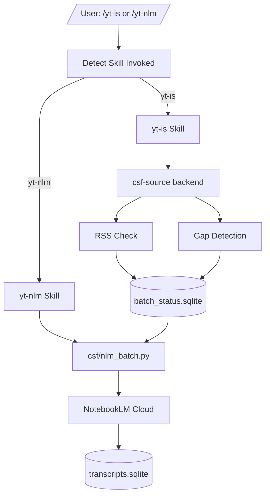

# yt-is — YouTube Intelligence System


YouTube transcript ingestion and analysis pipeline — discover new videos, download transcripts with automatic escalation (yt-dlp → NotebookLM), and store results in CKS.

## Operator Notes

For implementation gotchas, recurring bugs, and lessons learned from live canaries, see [CODEX_MEMORY.md](CODEX_MEMORY.md).

## Quick Start

```powershell
# Check tracked channels for new videos
/yt-is sync

# Industrial Ingest (NLM Batch) - BEST FOR BACKLOG (worker-count dependent; benchmark sweep continues through 8 workers)
/yt-nlm

# Surgical Fetch (yt-dlp -> Selenium fallback)
/yt-is fetch
```

## Installation

### Three Deployment Models

**IMPORTANT**: This package supports three different deployment modes. Choose the right one for your use case.

#### 1. SKILLS (Dev Deployment) ⭐ **Recommended for Development**

**For**: When you're actively developing this package and want instant feedback.

**Setup:**
```powershell
# Windows (Junction - No admin required)
New-Item -ItemType Junction -Path "P:\.claude\skills\yt-is" -Target "P:\.claude\skills\yt-is"
New-Item -ItemType Junction -Path "P:\.claude\skills\yt-nlm" -Target "P:\.claude\skills\yt-nlm"
```

**Key points:**
- Skills are in `P:/.claude/skills/yt-is/` and `P:/.claude/skills/yt-nlm/`
- Changes to skill files take effect immediately
- No reinstallation required

#### 2. SYMLINK (CLI Tools)

**For**: When you want `yt-is` and `csf-source` commands available in your terminal.

**Setup:**
```powershell
# Symlink bin tools to a directory in your PATH
cmd /c "mklink P:\bin\yt-is P:\packages\yt-is\bin\yt-is"
cmd /c "mklink P:\bin\csf-source P:\packages\yt-is\bin\csf-source"
```

**Key points:**
- `yt-is` — channel management (sync, list, add, fetch)
- `csf-source` — backend for channel and transcript operations
- Both commands share the same SQLite database

#### 3. PLUGINS (End User Deployment)

**For**: Distributing this package to other users via marketplace or GitHub.

**Setup:**
```bash
# End users install via /plugin command
/plugin P:/packages/yt-is

# Or from marketplace (when published)
/plugin install yt-is
```

## Skills

### `/yt-is` — YouTube Channel Management

Check all tracked YouTube channels for new videos and manage your channel list.

**Commands:**
- `sync` — Check all tracked channels for new videos
- `list` — List all tracked channels with metadata
- `add <url>` — Add a new channel or playlist to track
- `fetch` — Download transcripts for all pending videos using escalation chain

**Escalation Chain (per video):**
1. **yt-dlp (WEB client)** — Fastest (~5 seconds), works for most public videos
2. **yt-dlp with cookies** — For age-restricted videos
3. **Selenium Firefox** — Fallback for bot-check failures (~15-30 seconds)

### `/yt-nlm` — NotebookLM Transcript Extraction

Extract YouTube transcripts using NotebookLM's batch notebook workflow.

**Recommended approach:** Worker-owned batch notebooks (one notebook per worker title, reused across batches; batch size 200) — uses `nlm source content` (raw text), has auth auto-recovery built in.

**Auth contract for tests:** `nlm login` covers the CLI path only. The DOM/spinner readiness path uses a separate persistent Chrome profile and must be bootstrapped once with a signed-in browser session before DOM tests will work.

**Old approach (deprecated):** Ephemeral notebooks — one notebook per video, slow, wastes NotebookLM slots.

## CLI Tools

### `yt-is`

Channel management CLI wrapping `csf-source`.

```powershell
yt-is sync                  # Check all tracked channels for new videos
yt-is list                  # List all tracked channels
yt-is add <url>             # Add a new channel to track
yt-is fetch                 # Download pending transcripts (escalation chain)
yt-is fetch --dry-run       # Preview what would be fetched
yt-is fetch --source <url>  # Process only one channel
yt-is fetch --workers 2     # Use 2 parallel workers
```

### `csf-source`

Backend implementation for channel and transcript operations.

```powershell
csf-source list              # List all tracked sources
csf-source add <url>         # Add a new source
csf-source check <source>    # Check one source for new videos
csf-source check-all         # Check all sources for new videos
csf-source sync <source>     # Process pending videos for a source
csf-source fetch             # Download pending transcripts
csf-source fetch --dry-run   # Preview what would be fetched
```

## Pipeline Overview

```
/yt-is sync
    ↓
RSS check → Gap detection → API resolution
    ↓
batch_status.sqlite (pending videos)
    ↓
/yt-nlm (Industrial Cloud Ingest) —— [PRIMARY: 99% Signal SNR]
    ↓ OR
/yt-is fetch (Surgical Local) —— [FALLBACK: 40% Signal SNR]
    ↓
transcripts.sqlite (Provenance-tracked Clean Store)
    ↓
Combined markdown batches → CKS / Obsidian / analysis tools
```

## Data Flow

```
channel_metadata table (SQLite)
    │
    ├─► yt-is sync ──► RSS check ──► Gap detection ──► API resolution
    │                                                │
    │                                                ▼
    │                                       batch_status table (pending)
    │
    ├─► yt-is fetch ──► ESCALATION CHAIN (yt-dlp → Selenium) ──► transcripts.sqlite
    │
    └─► /yt-nlm ──► Batch notebooks ──► nlm source content ──► transcripts.sqlite
```

## Storage

- **batch_status.sqlite** — Channel metadata and video tracking
  - `channel_metadata` — tracked channels with playlist IDs
  - `analysis_status` — video status (pending/complete/failed), last_stage, failure_reason
- **transcripts.sqlite** — Cached transcripts keyed by video_id

## Environment Variables

| Variable | Required | Description |
|----------|----------|-------------|
| `YOUTUBE_API_KEY` | For gap resolution | YouTube Data API v3 key for filling RSS gaps |
| `NLM_AUTH_TOKEN` | For NotebookLM | NotebookLM session token |
| `NLM_PROJECT_ID` | For NotebookLM | GCP project ID for NotebookLM |
| `YTIS_SCAN_STATUS_INTERVAL_S` | Optional | Emit scan status heartbeats this often during `/yt-is sync` and `csf-source fetch` scans (default: 30) |

## Development

### Requirements

- Python 3.12+
- `yt-dlp>=2024.0.0`
- `nlm` CLI (NotebookLM command-line interface)
- Firefox (for Selenium fallback)

### Key Files

```
yt-is/
├── bin/
│   ├── yt-is               # Channel management CLI
│   └── csf-source          # Backend implementation
├── csf/
│   ├── transcript.py        # Transcript fetching (yt-dlp, NLM)
│   ├── batch_status.py      # SQLite storage for video tracking
│   ├── source_enumerator.py  # RSS + API enumeration
│   └── cache.py             # Transcript caching
└── skills/
    ├── yt-is/SKILL.md        # Channel management
    ├── yt-nlm/SKILL.md       # NotebookLM batch extraction
    └── yt-dlp/SKILL.md       # Local yt-dlp transcript fetching
```

## Architecture



---

**Key features:**
- Automatic escalation chain for transcript download
- Batch NotebookLM workflow with shared defaults in `csf/nlm_config.py` (`notebook_batch_size = 50`, `notebook_source_cap = 50`) and one notebook per worker title
- Auth auto-recovery for NotebookLM sessions
- Configurable NotebookLM policy via `csf/nlm_config.py` and the `YTIS_NLM_*` env vars it reads
- External transcript provider hook for custom sources
- Multi-terminal safe batch processing with InterProcessLock
- See [PLAYBOOK_LINKS.md](P:/packages/yt-is/PLAYBOOK_LINKS.md) for the debugging playbook, handoff, and memory pointers.
